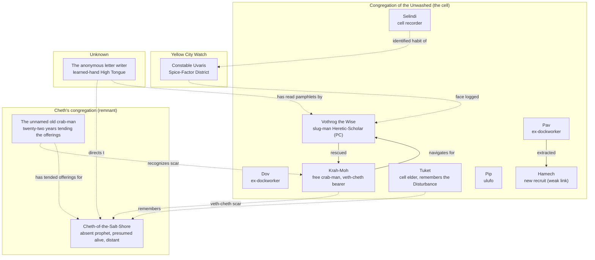

# Characters

Every named person in the campaign, grouped by faction. See
[[Adventure Log]] for chronological order; see [[Chronicle]] for the
running story.

## Relationship map

<details open>
<summary>Relationship diagram</summary>



</details>

## The Congregation of the Unwashed

The player character's cell, based at the [[Canal Quarter Safehouse]].

- [[Vothrog]] — *slug-man Heretic-Scholar; the PC.*
- [[Krah-Moh]] — *free crab-man, veth-cheth bearer, no Common.*
- [[Selindi]] — *cell recorder; runs the safe house in Vothrog's absence.*
- [[Dov]] — *ex-dockworker, brother of Pav.*
- [[Pav]] — *ex-dockworker, extracted Hamech from the Amber Moth.*
- [[Hamech]] — *new recruit; the weak link.*
- [[Tuket]] — *cell elder; remembers the Salt Shore Disturbance.*
- [[Pip]] — *ulufo cell member; absent during the raid.*

## Cheth's congregation (remnant)

- [[Cheth-of-the-Salt-Shore]] — *absent prophet; presumed alive, distant.*
- [[Old crab-man at the tidal mark]] — *twenty-two years tending the offerings.*

## Yellow City Watch

- [[Uvaris]] — *Spice-Factor District constable; logged Vothrog's face.*

## Unknown / off-stage

- [[Anonymous letter writer]] — *learned-hand High Tongue; pointed at Cheth.*

## Dataview index (renders inside Obsidian only)

```dataview
TABLE WITHOUT ID
  file.link as "Name",
  species as "Species",
  group as "Group",
  role as "Role",
  status as "Status"
FROM "Characters"
WHERE type = "character"
SORT group ASC, file.name ASC
```

## How to add a new character

When a new NPC enters the story:

1. Create `Characters/<Name>.md` with this frontmatter:
   ```yaml
   ---
   type: character
   name: <Display Name>
   species: <slug-man|human|crab-man|ulufo|...>
   caste: <low|scholarly|free|formerly enslaved|...>
   group: <faction or "unknown">
   role: <short role descriptor>
   alignment: <player-character|cell-ally|fragile-ally|antagonist|...>
   status: <active|off-stage|presumed alive, distant|...>
   first_appearance: "[[Turn 01]]"  # or whichever turn they enter
   publish: true
   ---
   ```
2. Add a wikilink to them from the relevant turn note and from this
   landing page.
3. Add a node + edges to the Mermaid diagram above if they're
   load-bearing for relationships.
