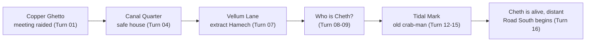

# Chronicle: Whitehack / Yoon-Suin / Echo Resounding

## The Player Character

Vothrog was a slug-man heretic-scholar operating at Level 1 with 0 XP. His attributes were STR 9, DEX 10, CON 11, INT 13, WIS 15, and CHA 13. He belonged to three groups: Heretic-Scholar as his vocation, Slug-Man as his species, and the Congregation of the Unwashed as his affiliation. He held one miracle slot with "Speak Truth to the Wretched" active and "Bind the Spirit of Oppression" and "The Poor Shall Inherit" inactive; after the night's rest the miracle slot was open again, with the choice of which working to carry south still before him. He carried a quarterstaff, leather armor worn beneath plain traveling robes, six pamphlets ("The Slime-Lords Drink What the Wretched Weep"), a writing kit, two weeks of trail rations for three, refilled waterskins, extra torches, river-cord, and fifty feet of hemp rope. He had 49 gold pieces remaining, the rest spent outfitting himself and two companions for the road south. His HP stood at 4 of 4, fully restored by a night's rest. He spoke Common, the Slug-Men High Tongue, and Low Caste Argot, and held a +2 saving throw bonus against magic and mind effects, healing at twice the normal rate.

## The Story So Far

Vothrog ran a secret congregation meeting in the Copper Ghetto before dawn. Twelve attendees scattered when Watch lanterns appeared in the alley below; a thirteenth, a free crab-man named Krah-Moh, was cornered by two constables and could not run. Vothrog descended from the dyewright's rooftop where the meeting had been held, secured his pamphlets in a chimney gap, and intercepted the Watch as a slug-man of apparent standing. He claimed Krah-Moh was a Magistrate's house-servant whose collar had been left at home, paid four gold pieces for the inconvenience, and walked away with Krah-Moh free. He then climbed back for the pamphlets and rope, and the two men moved north together toward the canal quarter, Krah-Moh navigating the back routes from memory.

At the canal quarter safe house, Vothrog introduced Krah-Moh to the waiting cell members and persuaded them to accept him. Selindi gave a status report: six of eleven fled members were safe in nearby houses; three were unaccounted for, of whom the old woman Tuket and an ulufo called Pip were expected to be fine; the third, Hamech, was a new recruit on only his second meeting who knew no safe-house protocols and had seen Vothrog's face. Selindi also produced a water-stained paper left at the cell's drop point before the meeting. The note was written in the High Tongue by someone who had clearly learned the script rather than been raised in it. It cited the pamphlets as correct but incomplete, and named a single lead: Cheth-of-the-Salt-Shore, with the instruction to find what had been done to that name.

Vothrog recognized that Hamech was likely sheltering at the Amber Moth tea house on Vellum Lane, a place he habitually used when frightened. Selindi revealed that Constable Uvaris of the Watch took his morning tea there every day without exception. Vothrog took Pav and Krah-Moh to the tea house at first light, arrived ahead of Uvaris, and sent Pav inside to extract Hamech while positioning himself to intercept the constable at the door. He engaged Uvaris directly, asking whether a man who enforced the movement ordinances against the poor slept well at night, and held the constable's attention long enough for Pav and Hamech to leave unseen. Uvaris did not see them go but would remember a slug-man in plain robes who had addressed him with that specific question.

Back at the safe house with Hamech in tow, Vothrog introduced himself plainly to Hamech and corrected his behavior — familiar haunts were exactly where not to go when things broke apart. He then asked the assembled cell whether anyone knew the name Cheth-of-the-Salt-Shore. Tuket and Selindi both reacted. Tuket described Cheth as a formerly enslaved crab-man who had escaped, arrived at the tidal salt flats south of Old Town, and preached the divine spark in the crab-men's own tongue, drawing human debt-workers into his congregation as well. His central claim had been that a being made property could not have been made so by any god worth the name. The Salt Shore Disturbance had occurred roughly twenty-two years earlier; the official record counted eleven dead and described it as a labor insurrection. Selindi noted eleven was a suspiciously small number for three days of confrontation. Cheth was absent from the official record entirely — not listed among the dead but taken deliberately, by men who knew who they were looking for. The salt-shore workers still left cracked shells and yellow flowers at the tidal mark on dark moon nights, and Tuket called them waiting offerings rather than mourning offerings. Krah-Moh had gone completely still during this account.

Vothrog extracted two leads from Selindi: the Cartulary of the Three Bells in the merchant quarter, a private archive that held material the Oligarchy's public records had quietly excised, and the Ward of the Salt Quarter in Old Town, where living witnesses to the Disturbance might still be found. He left six pamphlets with Selindi for distribution, instructed the cell to proselytize and assist the needy while he was gone, and departed south with Krah-Moh.

Krah-Moh navigated the approach to Old Town without hesitation, using routes that suggested he knew the ward personally. At the tidal mark, Vothrog found the offerings exactly as described — crab shells arranged in congregation-circles, cupped side up, with yellow marigold-analogues at their centers, the line running forty yards along the waterline in various stages of age and weathering. Krah-Moh lowered himself and touched the mud at the mark with a flat claw, a gesture that read as reverence. An ancient red-brown crab-man sat in the shadow of a collapsed archway twenty feet back, watching. His reaction roll suggested he was neutral but willing to be approached.

Vothrog cast "Speak Truth to the Wretched," spending one HP, and spoke plainly: that Cheth had said what was true, that the slug-lords' heaven was a story to justify the slug-lords' earth, that he himself was not Cheth but believed what Cheth had believed, and that he was not going away. Krah-Moh relayed this in crab-click language to the old man, who rose from his crouch, walked to the oldest offering on the line, touched it with a flat claw, and then looked at Vothrog directly for the first time. He clicked a single short phrase. Krah-Moh raised his open claw in a relay-ready gesture.

Vothrog examined the wave-scar on Krah-Moh's left shell closely. His INT check surfaced a connection to the High Tongue term veth-cheth — "the wave that carries" — used in pre-Oligarchy theological texts in exactly one context: the transmission of divine truth between vessels, the spark jumping the gap between bodies. The old man had recognized the mark before Krah-Moh had spoken a word, suggesting the mark carried specific meaning known to anyone connected with Cheth's congregation.

Through gesture, Vothrog asked whether Krah-Moh and the offerings tradition were connected. The old man rose, walked to Krah-Moh, and touched the edge of the wave-scar with a single claw-tip, then clicked a longer reply. Krah-Moh relayed it in gesture: both claws pressed flat against his own shell, then opened outward — the mark was given to him — and then his right claw tracing an arc from far away and south toward himself — from a distance, coming back. The old man's posture told Vothrog the rest: the veth-cheth giving mark could only be conferred by someone who carried the tradition of Cheth's congregation, the old man had not seen it on a living shell since before the Disturbance, and the only person who had given it in those years was Cheth himself. Krah-Moh's scar was recent — the shell still healing at the edges. Cheth appeared to be alive, somewhere distant, and Krah-Moh had come from that direction and been marked.

Vothrog acknowledged the old crab-man with a wordless bow — both hands pressed flat to his chest, held, then opened outward — and turned north with Krah-Moh at his shoulder. At the canal-quarter safe house he told the reassembled cell everything: the tidal offerings, the old man, the veth-cheth wave-mark, and the conclusion that Cheth-of-the-Salt-Shore was alive. He named the Cartulary of the Three Bells as the next line of inquiry and sent Selindi and Tuket to it — Selindi to read the record, Tuket to read the silences in it — charged with finding who had ordered Cheth taken and what the Oligarchy's archive had excised. Dov was left to hold the safe house, Hamech to continue protocol training under him, the remainder to pamphlet distribution. Vothrog slept the night through and woke fully restored, and turned over whether to carry "Speak Truth to the Wretched" south or prepare a different working. In the morning he provisioned at the merchant-quarter market fringe — two weeks of rations for three, refilled waterskins, river-cord, extra torches, twenty-seven gold pieces spent and forty-nine kept — and set the idea of a pack animal aside, the river-paths and coastal terrain south being no place for a mule. At a tea-stall by the river-steps he found, rather than sought, a possible henchman: a low-caste human woman with a quarter-staff and a circle-of-shells tattoo on her forearm, salt-shore by heritage through a grandmother who had been there before the Disturbance. She recognized the wave-scar on Krah-Moh's shell, and offered to carry the pack and watch their backs — on one condition: an honest answer to whether Vothrog truly knows what he is walking into.

## The Current Situation

Vothrog stands at the merchant-quarter river-steps in the clear yellow morning, rested and provisioned — full health, forty-nine gold pieces, two weeks of supplies for three. Krah-Moh waits to lead him south, toward the open water and the direction his own marking came from; Pav, who asked a night to decide, has chosen to come. Selindi and Tuket are already moving on the Cartulary of the Three Bells, to dig the Salt Shore Disturbance out of the Oligarchy's record. Three things hold Vothrog at the river-steps before he goes: the salt-shore woman's question — whether he knows what he is walking into, which she will not travel without an answer to; the choice of which miracle to carry south; and the question of what he will say to Cheth-of-the-Salt-Shore if the road actually reaches him. His face remains logged by Constable Uvaris.

## NPCs, Factions, and Places

**Krah-Moh** — free crab-man, ochre shell, old work-scars, white wave-scar on left shell (veth-cheth, a giving mark, conferring by Cheth himself and recently received); Vothrog's traveling companion; no Common; navigates Old Town from memory; was apparently sent or marked by Cheth and came from his direction. Loyal and present.

**Selindi** — human woman, low caste, cell recorder, speaks four languages; runs the safe house in Vothrog's absence; pragmatic and competent. Cell ally.

**Dov and Pav** — ex-dockworker brothers, burn-scarred forearms; cell members; Pav knew Hamech and helped extract him. Cell allies.

**Hamech** — human dockworker, low-merchant caste; new recruit, second meeting; extracted from Amber Moth; corrected on protocol; knows Vothrog's face and species. Currently oriented and present at the safe house. Weak link.

**Tuket** — old human woman, Yellow City native; attended the meeting, escaped undetected; holds significant personal memory of the Disturbance and of Cheth; gave Vothrog a low-caste blessing on departure. Cell elder, informally.

**Pip** — ulufo; cell member; absent but reliable; currently sleeping at the safe house on a coil of jute.

**The unnamed old crab-man** — ancient red-brown shell, twenty-two years tending the tidal mark offerings; recognized Krah-Moh's giving mark; shifted from neutral to fragile ally after learning Cheth may be alive.

**Uvaris** — Watch constable, spice-factor quarter; off-duty but thorough; takes morning tea at the Amber Moth daily; did not see Hamech extracted but will remember a slug-man in plain robes who asked if he sleeps well on Vellum Lane. A face logged against Vothrog.

**The salt-shore woman** — low-caste human, quarter-staff, calloused hands, a circle-of-shells tattoo on her left forearm; salt-shore by heritage through a grandmother who was there before the Disturbance. Found at a river-steps tea-stall as Vothrog provisioned; recognized Krah-Moh's veth-cheth mark on sight. Has offered to travel as henchman — carry the pack, watch their backs — but will not commit until Vothrog answers, honestly, whether he knows what he is walking into. Standard rate roughly 3 gp a week and keep.

**Cheth-of-the-Salt-Shore** — formerly enslaved crab-man; escaped, came south on the God River; preached the divine spark in the crab-men's tongue; founded a congregation among the tidal salt-flat workers; apparently divine or saint-like in the workers' tradition; taken (not killed) in the Salt Shore Disturbance twenty-two years ago; apparently alive and somewhere distant; the pivot of the campaign's emerging arc.

**The anonymous letter writer** — unknown; writes the High Tongue in a learned hand, not a slug-man; has read at least four of Vothrog's pamphlets; knew of Cheth and directed Vothrog to investigate what was done to that name; signed nothing. Motive unknown.

**The Congregation of the Unwashed** — Vothrog's cell and affiliation; eleven human and ulufo members plus Krah-Moh; based in the canal quarter safe house; currently proselytizing and distributing pamphlets under Selindi's management.

---

## Campaign arc — the road south

*From the Copper Ghetto raid to the recognition at the Tidal Mark.
What's next: find Cheth.*

## See also

For the structured per-character + per-location views:

- [[Characters/Characters|Characters index]] — *one note per named NPC, grouped by faction, with a relationship diagram.*
- [[Locations/Locations|Locations index]] — *one note per named place, with a geography hierarchy.*
- [[Adventure Log]] — *the chronological per-turn play record.*
- [[Events/Salt Shore Disturbance|The Salt Shore Disturbance]] — *the event that shaped the southern landscape.*

**The Yellow City, Copper Ghetto** — where the meeting was held and the night's trouble began.

**The Canal Quarter safe house** — Vothrog's base of operations; the cell's current refuge.

**The Amber Moth tea house, Vellum Lane** — Uvaris's morning haunt; no longer safe for Hamech.

**The Cartulary of the Three Bells, merchant quarter** — private archive holding excised historical material; not sympathizers but archivists; an unexplored lead on the Disturbance.

**The Ward of the Salt Shore, Old Town** — current location; ruined quarter where the salt-flat workers once congregated; the tidal mark with its twenty-two years of waiting offerings; living witnesses including the unnamed old crab-man.

## Open Threads

Cheth appears to be alive somewhere distant, and Krah-Moh carries his mark and came from that direction — where he is and what he wants are unresolved and central, and the road south is now Vothrog's attempt to close that distance. Selindi and Tuket are at the Cartulary of the Three Bells, which may hold what the official record excised about the Salt Shore Disturbance and who ordered Cheth taken; what they recover is still to come. The salt-shore woman at the river-steps has offered to travel as henchman but will not commit until Vothrog answers, honestly, whether he knows what lies ahead. Vothrog has a miracle to choose before he leaves. The anonymous letter writer who pointed him toward Cheth has still not identified themselves or made further contact. Uvaris has logged Vothrog's face and will know him again. Hamech remains the cell's most vulnerable member. Six pamphlets are in circulation in the Yellow City and six remain with Selindi. And Krah-Moh has not yet said directly what he knows of Cheth's whereabouts or the circumstances of his own marking — that conversation has not happened.
