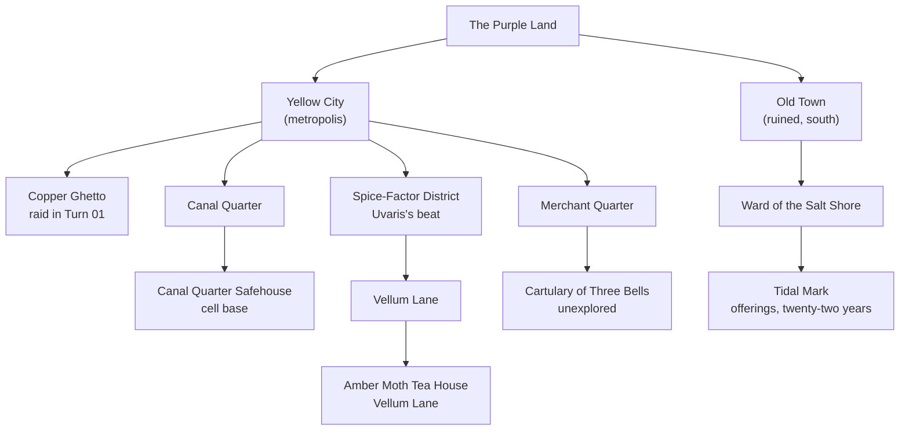

# Locations

Every named place in the campaign, organized by geography. See
[[Adventure Log]] for the chronological play record; see
[[Chronicle]] for the running story.

## Geography map

Also see the [[Maps/Maps|Maps]] folder for the city's quarters and sites rendered turn by turn.

<details open>
<summary>Geography map</summary>



</details>

## Inside the Yellow City

- [[Yellow City]] — *the metropolis; caste society of the Purple Land.*
- [[Copper Ghetto]] — *the cell's old meeting place; raided in [[Turn 01]].*
- [[Canal Quarter]] — *the cell's current refuge.*
  - [[Canal Quarter Safehouse]] — *the cell's base.*
- [[Spice-Factor District]] — *Uvaris's beat.*
  - [[Vellum Lane]]
    - [[Amber Moth Tea House]] — *Uvaris's morning haunt; Hamech extracted in [[Turn 07]].*
- [[Merchant Quarter]] — *home of the Cartulary.*
  - [[Cartulary of Three Bells]] — *unexplored archive.*

## Beyond the city walls

- [[Old Town]] — *south, ruined; site of the [[Salt Shore Disturbance]].*
  - [[Ward of the Salt Shore]] — *Vothrog's current location.*
    - [[Tidal Mark]] — *the offerings, the old crab-man, the recognition.*

## See also

- [[Events/Salt Shore Disturbance|The Salt Shore Disturbance]] —
  *the event that shaped the southern landscape and Cheth's silence.*

## How to add a new location

When the campaign visits somewhere new:

1. Create `Locations/<Place>.md` with this frontmatter:
   ```yaml
   ---
   type: location
   name: <Display Name>
   parent: "[[Yellow City]]" # or another parent location
   kind: <quarter|street|safe-house|archive|tea-house|ritual-site|...>
   publish: true
   ---
   ```
2. Wikilink it from the relevant turn note and from this landing page.
3. Add a node + edge to the Mermaid geography map above if the
   place is load-bearing.

